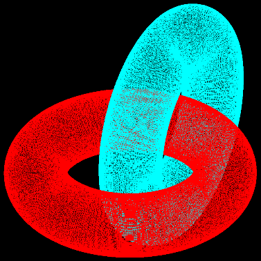

# Graphics engine

## Introduction

This graphical engine was developed as a project during my first year of Computer Science studies. The goal was to explore 
and implement various fundamental concepts in computer graphics, such as 3D transformations, Z-buffering and Lindenmayer systems.

Through this project, I gained hands-on experience with rendering techniques, 3D modeling, and the mathematical 
foundations of computer graphics. The engine is designed to be a flexible tool for generating and visualizing complex shapes 
and scenes using custom INI configuration files.

## How to Use the Graphical Engine

- **Input via INI File**:  
  Pass an INI file as a program argument to describe the drawing. Set the working directory to the folder containing the INI file. Example INI files can be found in the `ini` folder.

- **With Program Argument**:  
  If an INI file is provided as a program argument, the program generates a BMP file with the same name in the specified folder, and also creates an `out.bmp` file in the root directory.

- **No Program Argument**:  
  If no program argument is given, the engine will automatically generate BMP files for each INI file in the working directory's `filelist`.

## Implemented features

- **2D Line drawings**
- **3D wireframes**
- **3D Solids**
    - cube
    - tetrahedron
    - octahedron
    - dodecahedron
    - icosahedron
    - sphere
    - cylinder
    - torus
- **Transformations**
    - Eye-point
    - Projection
    - rotation/translation
- **Z-Buffering (lines)**
- **Z-Buffering (triangulation)**
- **3D Fractals**
- **2D Lindenmayer Systems**
- **3D Lindenmayer Systems**
- **Ambient Light**

## Attribution Requirement

If you use or copy any part of this project, please ensure to give proper credit by mentioning my name. 
Any form of plagiarism is not allowed.

## Original Feature List

Below is the original list of features and their status as provided by the university. This includes both implemented and planned functionalities.

|   | Functionaliteit      | Status |
|---|---------------------------|--------|
| 1 | 2D L-systemen             | V      |
|   | Met haakjes               | V      |
|   | Stochastisch              |        |
| 2 | Transformaties            | V      |
|   | Eye-point                 | V      |
|   | Projectie                 | V      |
| 3 | Platonische Lichamen      | V      |
|   | Kegel en cylinder         | V      |
|   | Bol                       | V      |
|   | Torus                     | V      |
|   | 3D L-systemen             | V      |
| 4 | Z-buffering (lijnen)      | V      |
| 5 | Triangulatie              | V      |
|   | Z-buffering (driehoeken)  | V      |
| 6 | 3D fractalen              | V      |
|   | BuckyBall                 |        |
|   | Mengerspons               |        |
|   | View Frustum              |        |
| 7 | Ambient licht             | V      |
|   | Diffuus licht (oneindig)  |        |
|   | Diffuus licht (puntbron)  |        |
|   | Speculair licht           |        |
| 8 | Schaduw                   |        |
|   | Texture mapping           |        |
| 9 | Bollen en cylinders       |        |
|   | UV-coordinaten            |        |
|   | Cube mapping              |        |

